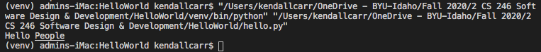

# Overview
This program says hello to people. It dementstrates the use of GitHub, Python and Visual Studio Code.

# Development Environment
* Visual Studio Code
* Python 3.8.5

# Execution
To execute the program: `python hello.py`

Or you can also click play in Visual Studios.

# Useful Websites
* [Virtual Environments and Packages](https://docs.python.org/3/tutorial/venv.html)
* [Python Tutorial](https://docs.python.org/3/tutorial/)